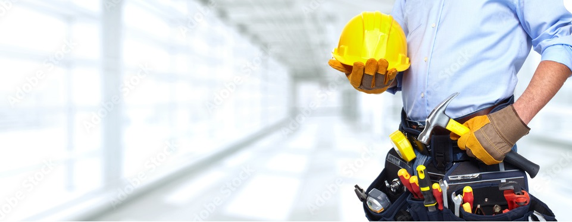
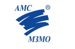
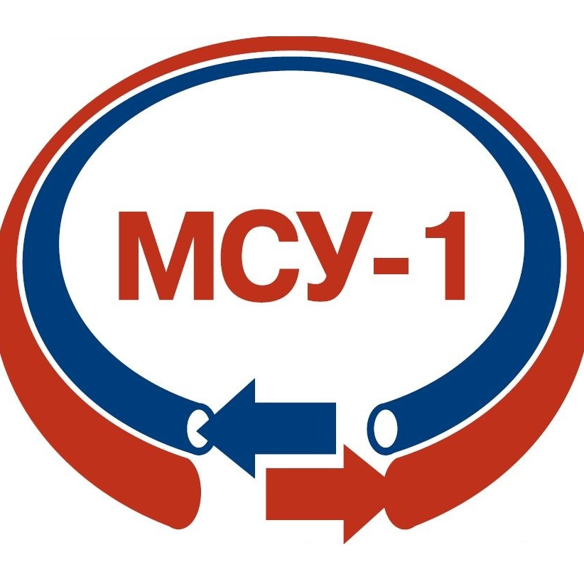

<!DOCTYPE html>
<html lang="ru">
<head>
    <meta charset="UTF-8">
    <meta name="viewport" content="width=device-width, initial-scale=1.0">
    <title>ИП Саманков В.В. - Монтаж чистых помещений</title>
    
</head>
<body>
    <!-- Титульный слайд -->
    

        <h1>ИП Саманков Владимир Валерьевич</h1>
        
Профессиональный монтаж чистых помещений

        
Официальный партнер ведущих производителей ограждающих систем

    

    <!-- О компании -->
    

        <h2>О компании</h2>
        

            

                
Мы специализируемся на производстве и монтаже конструкций для чистых помещений, обеспечивая полный цикл работ от проектирования до ввода в эксплуатацию.

                
                
Как надежный партнер крупных производителей ограждающих систем, мы предлагаем:

                <ul>
                    <li>Прямые поставки качественных материалов</li>
                    <li>Техническую поддержку на всех этапах</li>
                    <li>Соблюдение строгих отраслевых стандартов</li>
                    <li>Гарантию на все виды работ</li>
                </ul>
            

            

    

        
    

            

        

    

    <!-- Услуги -->
    

        <h2>Наши услуги</h2>
        
        

            <h3>Монтаж чистых помещений "под ключ"</h3>
            
Полный комплекс работ по созданию чистых помещений различных классов чистоты с соблюдением всех нормативных требований (GMP, ISO 14644 и др.)

        

        
        

            <h3>Установка ограждающих конструкций</h3>
            
Монтаж стеновых и потолочных панелей, дверей, смотровых окон и переходных шлюзов из современных материалов с высокой герметичностью

        

        
        

            <h3>Монтаж вентиляционных систем</h3>
            
Установка систем вентиляции и кондиционирования с HEPA-фильтрами для обеспечения требуемых параметров воздушной среды

        

        
        

            <h3>Слаботочные системы и электромонтажные работы</h3>
            
Монтаж системы СКУД,АПС,Видеонаблюдение,ЭО,ЭМ

        

    

    <!-- Партнеры -->
    

        <h2>Наши партнеры</h2>
        
Мы сотрудничаем с ведущими производителями ограждающих систем и материалов для чистых помещений:

        
        

            
            
            
            
        

        
        
Это партнерство позволяет нам предлагать клиентам:

        <ul>
            <li>Доступ к новейшим технологиям и материалам</li>
            <li>Конкурентные цены за счет прямых поставок</li>
            <li>Техническую поддержку от производителей</li>
            <li>Гарантию качества на все компоненты</li>
        </ul>
    

    <!-- Преимущества -->
    

        <h2>Почему выбирают нас</h2>
        

            

                <h3>Наши конкурентные преимущества</h3>
                <ul>
                    <li><strong>Опыт:</strong>С 2018 г. в сфере монтажа чистых помещений</li>
                    <li><strong>Команда:</strong> Квалифицированные специалисты с профильным образованием</li>
                    <li><strong>Качество:</strong> Строгий контроль на всех этапах работ</li>
                    <li><strong>Сроки:</strong> Точно соблюдаем оговоренные сроки реализации проектов</li>
                </ul>
            

            

                <h3>Для каких отраслей мы работаем</h3>
                <ul>
                    <li>Фармацевтическая промышленность</li>
                    <li>Микроэлектроника и приборостроение</li>
                    <li>Медицинские учреждения и лаборатории</li>
                    <li>Пищевая промышленность</li>
                    <li>Космическая и авиационная отрасли</li>
                </ul>
            

        

    

    <!-- Контакты -->
    

        <h2>Контакты</h2>
        

            
<strong>ИП Саманков Владимир Валерьевич</strong>

            
Специализация: производство монтажных работ в сфере чистых помещений

            
ИНН:672604891121

            
ОГРНИП:324670000051380

            
Телефон:+79966287008

            
Email:samankovv@yandex.ru

            
Адрес:Москва г.Зеленоград пр.проезд 4055 д. 5

            
        

        
Готовы обсудить ваш проект! Оставьте заявку для консультации.

    

</body>
</html>
